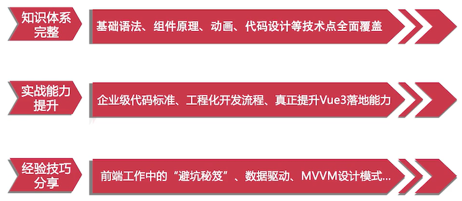
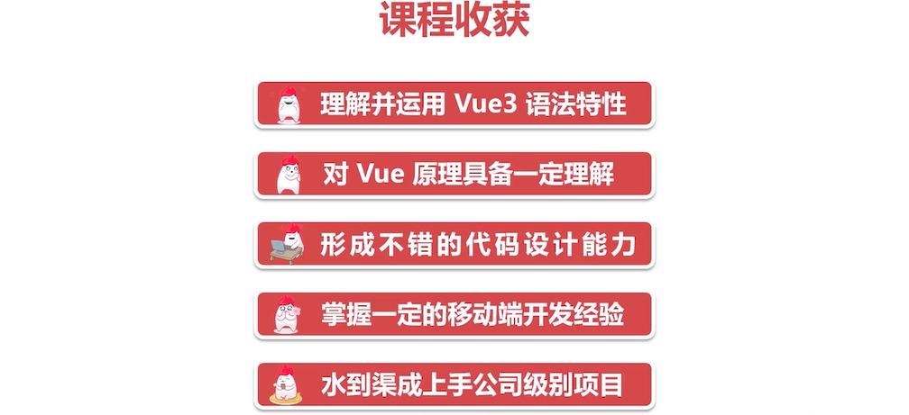

`Vue3 系统入门与项目实战 全方位知识点+高匹配度项目，轻松入门，深度掌握`

# 第1章 Vue 语法初探

## 1-1 课前须知，这里有你需要了解的一切





## 1-3 初学编写 HelloWorld 和 Counter

```html
<!DOCTYPE html>
<html lang="en">
<head>
    <meta charset="UTF-8">
    <title>hello world </title>
    <script src="https://unpkg.com/vue@next"></script>
</head>
<body>
<div id="root">
</div>

</body>
<script>
    <!--    创建vue模板 -->
    Vue.createApp({
        data() {
            return {
                count: 1
            }
        },
        mounted() {
            setInterval(() => {
                this.count++
            }, 1000)
        },
        template: '<div>hi</div>' +
                '<div>    {{count}} </div>'
    }).mount('#root')
</script>
</html>
```

## 1-4 编写字符串反转和内容隐藏小功能

### 反转

```js
 Vue.createApp({
    data() {
        return {
            content: 'hello world'
        }
    },
    methods: {
        handleBtnClick() {
            this.content = this.content.split('').reverse().join('');
        }
    },
    template: `
      <div>
        {{content}}
        <button v-on:click="handleBtnClick">反转</button>
      </div>
    `
}).mount('#root');
```

### 显示隐藏

```js

data()
{
    return {show: true}
}
,
methods: {
    handleBtnClick()
    {
        this.show = !this.show;
    }
}
,
template: `
      <div>
        <span v-if="show">hello world</span>
        <button v-on:click="handleBtnClick">显示/隐藏</button>
      </div>
    `
}).
mount('#root');
```

## 1-5 编写TodoList 小功能，了解循环和双向绑定

## 1-6 组件概念初探，对 TodoList 进行组件代码拆分 

